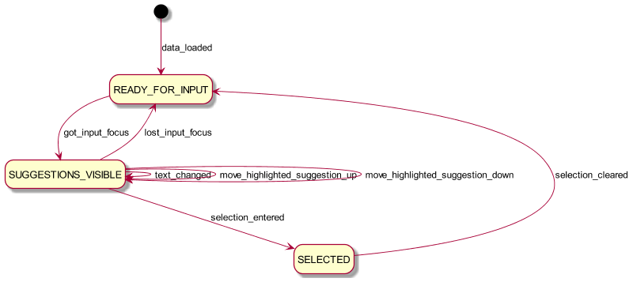

## TYPEAHEAD Finite State Machine

### Features
- Wait until we’ve pulled the state & country data from the server before displaying the UI (“loading…”)
- Only show the suggestions when the input box has focus
- Compute suggestions on each keystroke
- Move the highlighted selection on up & down keystrokes
- Show a “selected” UI when a selection has been made

### State diagram

